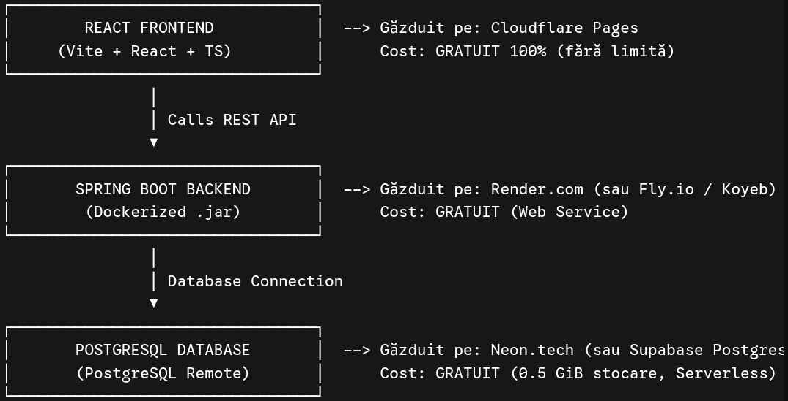

# Decision Taker

Relevant information about the project is describe in the next chapters.

# Overview

A web app that helps you take decisions when you are too confused to reason things out.

It is built using React (fronend, hosted on Cloudflare Pages), Spring Boot (backend hosted on Fly.io) and Postgresql for the database (Neon.tech).

This image describes the architecture of the app. I asked an AI to draw it using characters, hope you like how it looks. The text is in Romanian language, but it mostly said what I told in the paragraph from above.
# 

# Frontend

The frontend uses React with TypeScript and wants to achieve a simple look, minimalist and brutalist, in order to guide the user towards the functionality of the app.

# Backend

Spring Boot ensures authentication, data integrity and provides a mature framework for the development. Spring Security, Hibernate JPA and many others popular dependencies were used to develop this project.

# Database

Stores users data, including it`s previous decisions that he took.